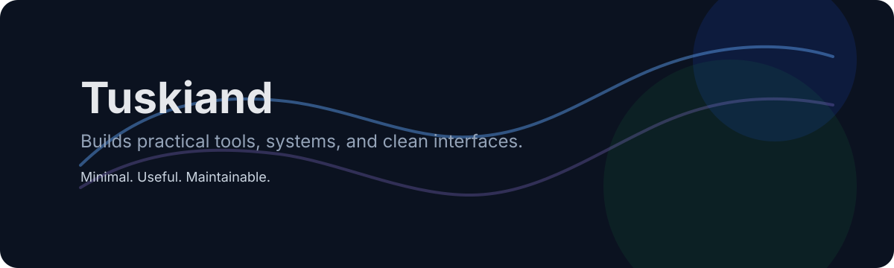

  

## About Me

- 🛠 I build practical tools, systems, and clean interfaces.
- 🧩 I care about clear structure and long-term maintainability.
- 🏥 I am interested in healthcare information systems.
- ✨ I prefer simple pages that still feel complete.

## Tech Stack

  

## Currently

- Building small tools and system-oriented projects
- Keeping the profile clean and readable
- Removing unnecessary clutter from the page

## Find Me

- GitHub: [Tuskiand](https://github.com/Tuskiand)

Minimal, useful, maintainable.

